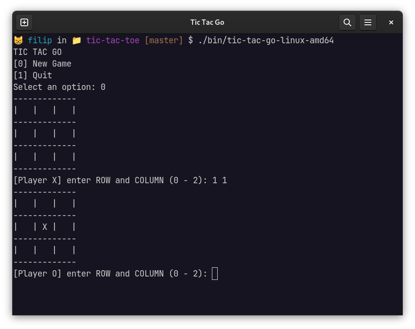

# Tic Tac Go

Multiplayer game of Tic Tac Toe written in Go

## Screenshots



## Release installation
[Download executable](https://github.com/filip0s/tic-tac-go/releases/) for your operating system and run it.

## Application setup for development
### Prerequisites
- [Golang](https://go.dev/dl/) installed on your system
- [Git](https://git-scm.com/downloads) for cloning this repository
- [Make](https://www.gnu.org/software/make/) for simple building and running
  - Make is installed on vast majority of UNIX-based systems
  - You can check if make is present on your system by running `which make`

### Downloading 
```shell
git clone git@github.com:filip0s/tic-tac-go.git 
cd tic-tac-go/
go mod tidy # Cleaning dependencies (just in case)
```

### Running
```shell
make run
```

### Other Makefile targets
- Building the project into `bin/` directory (creates if doesn't already exist)
```shell
make build
```

- Compiling executables for all major platforms into `bin/` directory (creates if doesn't already exist)
```shell
make compile
```

Overview of target platforms

| OS / Architecture | amd64 | i386 | arm | arm64 |
|-------------------|-------|------|-----|-------|
| Linux             | X     | X    | X   |       |
| Windows           | X     | X    |     |       | 
| Darwin (MacOS)    | X     |      |     | X     |

- Cleaning `bin/` directory
```shell
make clean
```